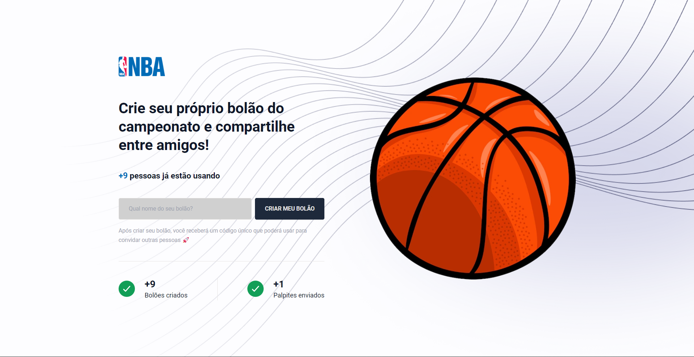
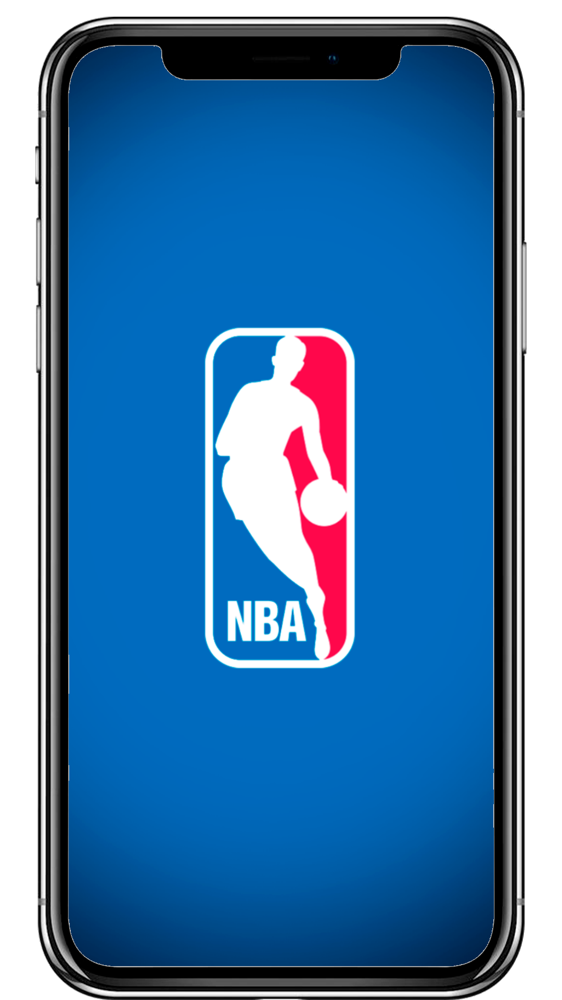
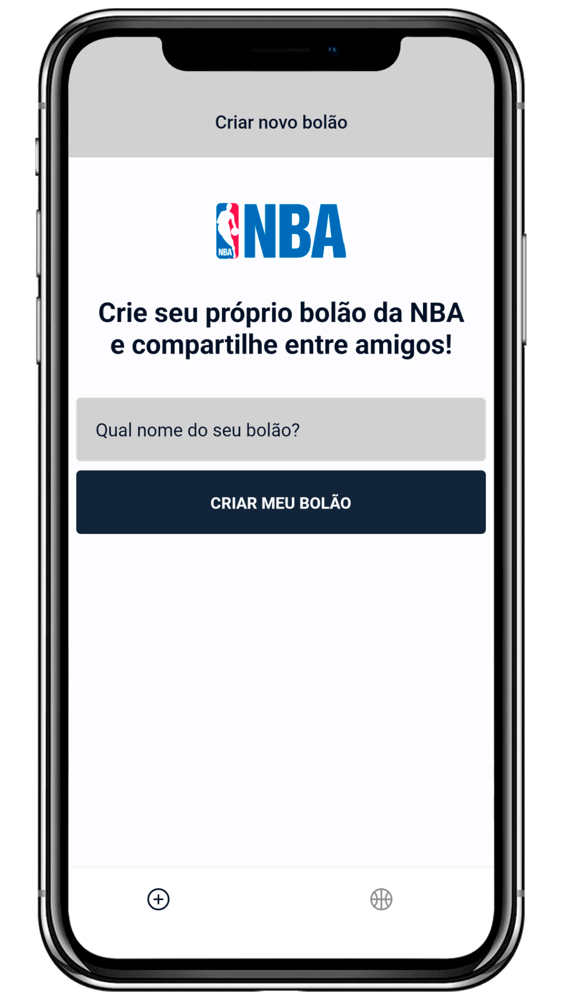
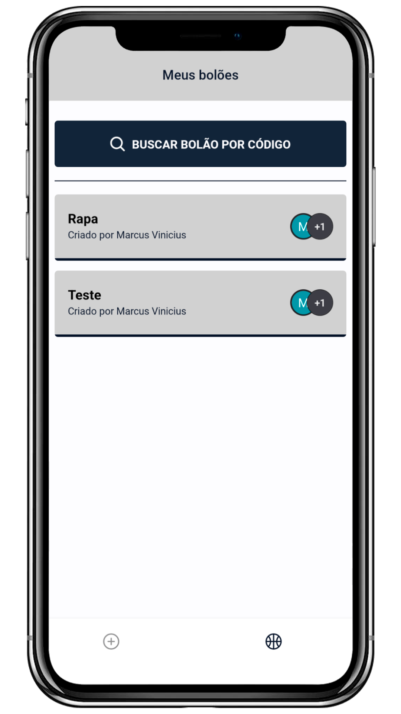
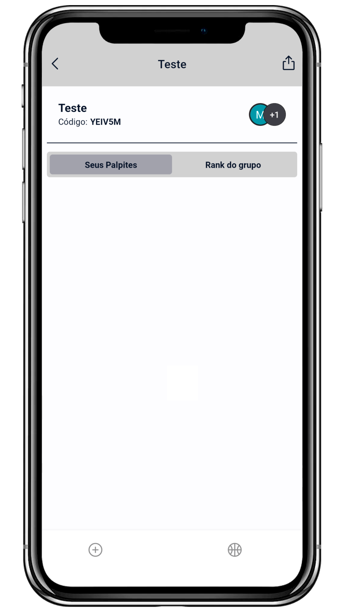
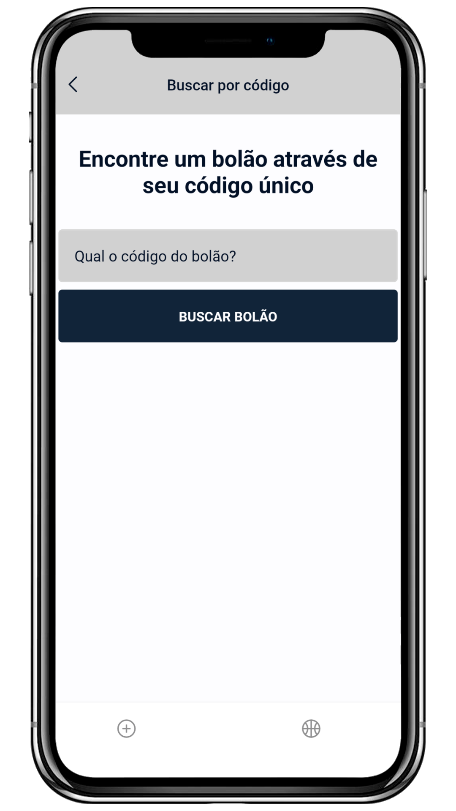

<h1 align="center">Championship 🏆</h1>

<p align="center">🔥 Bolão NBA! Uma ótima aplicação para se divertir com a família e amigos!! </br>(PROJETO EM CONSTRUÇÃO)</p>

<p align="center">
 <a href="#-executar">Como executar</a> •
 <a href="#-tecnologias">Tecnologias</a> •
 <a href="#-projeto">Projeto</a> • 
 <a href="#-objetivo">Objetivo</a> • 
  <a href="#-roadmap">Roadmap</a>
</p>

<br />

## 💻 Version Web

<br />

<div id="layout" align="center">
  <p align="stretch">
    
  </p>
</div>

## 📲 Version Mobile

<br />

<div id="layout" align="center">
  <p align="stretch">
    
    
    
    <br>
    
    
    
  </p>
</div>

<br />


## 🚀 Como executar

Clone o repositório e acesse a pasta.

```bash
$ git clone https://github.com/maarcusvinicius/Championship.git

Para iniciar o projeto:

# Instalar as dependências
$ npm install / yarn

# Iniciar o projeto
$ npm run / yarn run
```
A aplicação pode ser acessada em [`localhost:#`](http://localhost:#).

<br />

## 🔧 Tecnologias

Esse projeto foi desenvolvido com as seguintes tecnologias:

- [React](https://reactjs.org/) / [React Native](https://reactnative.dev/)
- [TypeScript](https://www.typescriptlang.org/)
- [NativeBase](https://nativebase.io/)
- [Nextjs](https://nextjs.org/)
- [Tailwindcss](https://tailwindcss.com/)
- [Node e NPM](https://nodejs.org/)
- [Expo](https://expo.dev/)
- [Authentication Expo](https://docs.expo.dev/guides/authentication/)

<br />

## 💻 Projeto

O Championship é um projeto que simula um bolão via Mobile, onde é possível criar seu bolão via Web e verificar seu bolão na versão Mobile, verificar qual dos times vão jogar com login de autenticação Google feito tudo com Back End em server Node.js!! (Projeto apresentou alguns bugs e já estou ciente!)

<br />

## ✅ Objetivo

Me aprofundar mais em Clean Code, TypeScript, e utilização de Next.js com aprimoração do meu desenvolvimento com Node.js melhoras de futuros projetos, acessível e de fácil compreensão!!

<br />

## 🏍️ Roadmap

<br />

    - [x] Criação site Web

    - [x] Criação plataforma Mobile

    - [x] Criação Back End da aplicação

    - [x] Configuração Tailwind Css

    - [x] Tratamento de dados sensíveis com .env

    - [x] Criação de bolão com código de compartilhamento

    - [x] Ver jogos do dia (estou ciente do bug)

    - [ ] Rank do bolão

    - [ ] Deploy Vercel

<br />

<h4 align="center"> 
	🚧  Championship 🏆 EM CONSTRUÇÃO...  🚧
</h4>
<br />

<br />

Feito com ❤️ por Marcus Vinicius 👋🏽 Entre em contato!


//feito readme marcus 


### Olá, sou Marcus 

Sou Desenvolvedor Web, um programador procurando fazer a diferença no mundo digital. [**Profile Github**](https://github.com/maarcusvinicius). 🚀

#### Minhas ferramentas atuais
📲 Front-end Mobile com React Native  
🌎 Front-end Web com Reactjs  
📡 Back-end com Nodejs  
🛠️ Typescript  
🧰 And more...  


#### 💬 Encontre-me em outro lugar

[](https://www.linkedin.com/in/marcus-vinicius-507718228/)
[](marcus.editor77@gmail.com)
